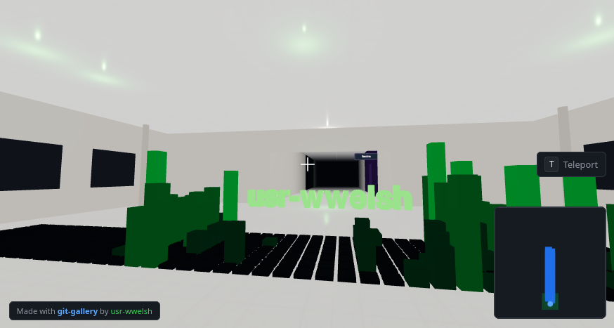

# Git Gallery

[](https://gallery.wwel.sh) [](LICENSE)

A 3D museum built from your GitHub profile. Walk through a lobby displaying your contribution graph, then explore a hallway of rooms — one per repository — with README panels, file trees, language stats, and floating artifacts.

[](https://gallery.wwel.sh/#room/git-gallery)

Built with [Three.js](https://threejs.org/) and [Vite](https://vitejs.dev/).

## Controls

**Desktop**

| Key | Action |
|-----|--------|
| Click | Lock pointer & start |
| W A S D | Move |
| Mouse | Look around |
| Shift | Run |
| Esc | Pause / unlock |
| T | Teleport to room |

**Mobile** — virtual joystick (left) to move, swipe (right) to look. Tap the teleport badge to jump between rooms.

Hover over doorway portals to see repository info. README panels and file trees lazy-load as you enter each room. URLs update as you move (`#room/repo-name`, `#lobby`) so you can deep-link directly to a room.

## Using Your Own GitHub Profile

Open `src/main.js` and change the `username` field at the top of the `CONFIG` object:

```js
export const CONFIG = {
  username: 'your-github-username',
  // ...
};
```

Save the file and the dev server will hot-reload with your data. The gallery pulls public repositories, contribution history, language stats, and READMEs automatically.

> **Note:** The GitHub API allows 60 unauthenticated requests per hour. Initial load uses ~22 calls, so you have plenty of headroom for normal use. To raise the limit to 5,000 req/hr, create a `.env` file with a [personal access token](https://github.com/settings/tokens) (no scopes needed):
>
> ```
> VITE_GITHUB_TOKEN=ghp_xxxxxxxxxxxx
> ```

## Running Locally

```bash
npm install
npm run dev
```

Then open [http://localhost:5173](http://localhost:5173).

## Building

```bash
npm run build   # outputs to dist/
npm run preview # preview the production build locally
```

The `prebuild` step (`node scripts/cache-github.js`) snapshots all GitHub data into the bundle so the deployed site loads instantly with zero API calls.

## Docker

```bash
docker build -t git-gallery .
docker run -p 8080:8080 git-gallery
```

## Inspiration

Git Gallery is inspired by [**Museum of All Things**](https://mayeclair.itch.io/museum-of-all-things) by [Maya Claire](https://may.as/) — a beautiful piece that imagines the internet as a walkable museum. Git Gallery applies that same idea to a GitHub profile, turning commit history and code into architecture you can move through.

## License

[MIT](LICENSE)
